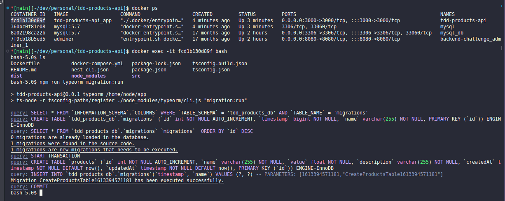

<h1 align="center">
  <br/>

  TDD products api
</h1>

<p align="center">
  

  
  
  <a href="https://github.com/LucasPereiraMiranda/tdd-products-api/commits/master">
    
  </a>

  <a href="https://github.com/LucasPereiraMiranda/tdd-products-api/issues">
    
  </a>

  <a href="https://github.com/LucasPereiraMiranda/tdd-products-api/issues">
    
  </a>
</p>

<br>

## 🚀 Techs

TDD products api was developed with these technologies

- [Nest](https://nestjs.com/)
- [Node](https://nodejs.org/en)
- [Typeorm](https://typeorm.io/)
- [Docker](https://www.docker.com/)
- [Postgres](https://www.postgresql.org/)
- [Jest](https://jestjs.io/pt-BR/)

## 💻 Project

This project's API has been developed with the primary objective of studying and exploring the core principles of Test Driven Development (TDD) and automated testing in general.

This version provides more clarity and completeness by specifying the purpose of the API and emphasizing its objective of studying and exploring the principles of TDD and automated testing.

## :boom: Installation

```bash
# clone this repo
$ git git@github.com:LucasPereiraMiranda/tdd-products-api.git

# run with compose services (app and mysql)
$ docker-compose up

# open new terminal and run migrations  (replace app_docker_container_id to our app docker container id)
$ docker run exec -it app_docker_container_id bash

# run migrations inside container
$ npm run typeorm migration:run

```

### Image details to run migrations

<h1 align="center">
    
</h1>

## Test

```bash
# unit tests
$ npm run test

# e2e tests
$ npm run test:e2e

# test coverage
$ npm run test:cov
```
